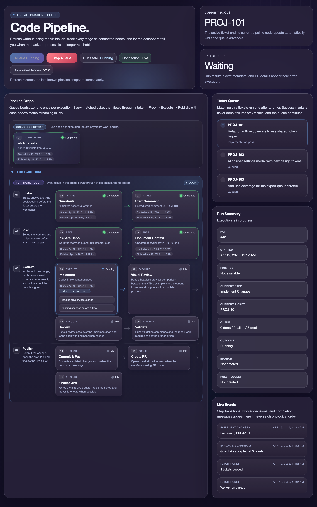

# CodePipeline

> Cautious, human-reviewed automation from Jira ticket to draft pull request — not an autonomous merge bot.

CodePipeline is an experimental self-hosted Node.js + TypeScript service that pulls one Jira issue at a time from a queue, prepares an isolated git worktree for a target repository, runs Codex CLI against that repository, validates the result, and then opens a draft GitHub pull request or optionally commits directly to a non-`main` base branch.

It is built for cautious human-reviewed automation rather than fully autonomous delivery.



## Status

- Beta and intentionally conservative
- Single worker process, single target repository, in-memory run state
- Best fit for teams that already use Jira, GitHub, npm-based repositories, and Codex CLI
- Roadmap: [docs/ROADMAP.md](./docs/ROADMAP.md)
- Release notes: [CHANGELOG.md](./CHANGELOG.md)
- Docker, history cleanup, and troubleshooting live under [docs/](./docs)

CodePipeline is distributed as source, not as an npm package — clone the repo to run it.

## What It Does

- Reads issues from Jira using either a full JQL query or a simpler project/label/status queue
- Applies guardrails to skip weak or unsafe tickets
- Clones and refreshes a persistent local mirror of the target repository
- Creates a fresh per-ticket git worktree and branch
- Runs Codex CLI for context gathering, implementation, review, and validation repair
- Optionally performs browser-based visual comparison when a ticket includes HTML example assets
- Creates a draft GitHub pull request after validation, or commits directly to a non-`main` base branch when enabled
- Posts the result back to Jira

## Current Assumptions

- Jira is the work queue and GitHub is the delivery destination
- Validation commands are configurable, but the default command set assumes an npm-based repository
- Codex CLI is installed locally and can be invoked as `codex` unless `CODEX_CLI_PATH` is set
- The dashboard is served by the app itself and bundled into a local browser asset during build/dev

## Quickstart

1. Install dependencies.

```bash
npm install
npm run playwright:install
```

2. Copy the example environment file.

```bash
cp .env.example .env
```

3. Fill in Jira, GitHub, git remote, and OpenAI credentials.

4. Build and start the service.

```bash
npm run build
npm run dev
```

5. Open `http://localhost:3000` and start a run from the dashboard, or trigger one manually:

```bash
curl -X POST http://localhost:3000/run-next
```

For a safer first verification run that skips push, pull request creation, and Jira mutations:

```bash
curl -X POST "http://localhost:3000/run-next?dryRun=true"
```

### No-credential demo

To see how guardrails and branch naming would treat a handful of example tickets without any Jira, GitHub, or Codex credentials:

```bash
npm install
npm run demo
```

The demo reads the fixtures under `fixtures/tickets/`, runs `evaluateTicketGuardrails` and `slugify` against them, and prints the decision for each. Nothing external is contacted.

## Requirements

- Node.js 22 or newer
- Git installed locally
- Access to a Jira project and API token
- Access to the target GitHub repository and a token with pull request permissions
- A git remote for the repository being automated
- An OpenAI API key
- Codex CLI installed locally

## Configuration

### Server

- `PORT`: HTTP port for the Express server
- `LOG_LEVEL`: Simple log label for local runs

### Jira

- `JIRA_BASE_URL`: Jira base URL such as `https://company.atlassian.net`
- `JIRA_EMAIL`: Jira user email for basic auth
- `JIRA_API_TOKEN`: Jira API token
- `JIRA_JQL`: Optional full JQL override
- `JIRA_PROJECT_KEY`: Simpler project-based queue configuration when `JIRA_JQL` is not used
- `JIRA_QUEUE_LABEL`: Optional label filter used with `JIRA_PROJECT_KEY`
- `JIRA_QUEUE_STATUS`: Optional status filter used with `JIRA_PROJECT_KEY`
- `JIRA_FORCE_INCLUDE_KEYS`: Optional comma-separated Jira keys to force-include
- `JIRA_DONE_LABEL`: Label added to successful tickets and excluded from future queue picks
- `JIRA_REVIEW_TRANSITION_NAME`: Jira transition target to try after a successful run
- `JIRA_COMMENT_PREFIX`: Prefix prepended to automation comments posted back to Jira

### GitHub

- `GITHUB_API_BASE_URL`: Usually `https://api.github.com`
- `GITHUB_TOKEN`: GitHub token for creating pull requests
- `GITHUB_OWNER`: Repository owner or organization
- `GITHUB_REPO`: Repository name

### Git And Workspace

- `GIT_REMOTE_URL`: Clone URL for the target repository
- `GIT_BASE_BRANCH`: Base branch to branch from and target in pull requests; if it does not exist on origin yet, CodePipeline creates it from the remote default branch
- `GIT_DIRECT_COMMITS`: When `true`, validated changes are committed directly to `GIT_BASE_BRANCH` unless it is `main`
- `WORK_ROOT`: Root directory where the persistent repo mirror and per-ticket worktrees are created

### Codex And Review

- `OPENAI_API_KEY`: API key available to the Codex CLI run
- `OPENAI_MODEL`: Model passed to Codex CLI
- `CODEX_CLI_PATH`: Path to the `codex` executable
- `GUARDRAIL_HARD_BLOCKED_KEYWORDS`: Optional JSON array or comma/newline-separated list of truly unsafe keywords or phrases; set it blank to disable keyword hard blocks
- `GUARDRAIL_SCAN_HUMAN_COMMENTS`: When `true`, Jira human comments are included in keyword hard-block scanning
- `GUARDRAIL_WEAK_REQUIREMENT_THRESHOLD`: Minimum requirement-strength score before a ticket is skipped as underspecified
- `BYPASS_CONFIRMATION_REVIEW_FOLLOW_UP`: When `true`, a second review that still returns `needs_follow_up` posts a Jira warning comment with the findings and allows the pipeline to continue
- `VALIDATION_COMMANDS`: Optional JSON array or newline-separated list of validation commands to run inside the target repository
- `VALIDATION_REPAIR_ATTEMPTS`: Max number of automated repair attempts after validation failures
- `DRY_RUN_BY_DEFAULT`: When `true`, runs stop before commit/push, PR creation, and Jira mutations unless explicitly overridden
- `VISUAL_REVIEW_ENABLED`: Enables browser-based HTML vs implementation comparison
- `VISUAL_REVIEW_TIMEOUT_MS`: Per-page timeout for headless browser capture
- `VISUAL_REVIEW_STARTUP_TIMEOUT_MS`: Timeout while waiting for a local preview server to start
- `VISUAL_REVIEW_STORAGE_STATE`: Path to a Playwright storage-state file used for authenticated implementation targets

### Visual review behind a login

When the implementation target lives behind an authenticated dashboard, mark it `"authenticated": true` in the ticket's visual plan and prime a reusable session once:

```bash
VISUAL_REVIEW_LOGIN_URL=https://dashboard.example.invalid/login npm run visual:login
```

A browser window opens for you to sign in (including any MFA steps). Press Enter in the terminal once you are logged in; the helper writes the session to `VISUAL_REVIEW_STORAGE_STATE` (defaults to `.visual-review/storage-state.json`). Subsequent visual review runs reuse that state instead of prompting for credentials.

## API

### `GET /health`

Returns:

```json
{ "ok": true }
```

### `POST /run-next`

Runs one serialized processing attempt for the next Jira issue in the configured queue.

### `GET /api/run-state`

Returns the current in-memory workflow snapshot used by the dashboard.

### `GET /api/run-events`

Streams live workflow updates over Server-Sent Events.

### `POST /api/run`

Starts a worker run asynchronously for the browser UI. If a run is already active, the endpoint returns HTTP `409`.
Pass `{"dryRun": true}` in the JSON body to skip publish and Jira mutation steps.

### `POST /api/run/dry-run`

Starts a dry run asynchronously for the browser UI. The worker still fetches Jira tickets, prepares the repository, runs Codex, and performs validation, but it skips commit/push, pull request creation, and Jira updates.

### `POST /api/run/stop`

Requests that the active run stop at the next safe interruption point.

## Worker Flow

1. Load queued Jira tickets.
2. Apply automation guardrails:
   configurable hard-block keywords plus a minimum requirements-strength check.
3. Refresh the persistent mirror and create a fresh worktree.
4. Create a branch named `ai/<ticket>-<slug>`.
5. Run a Codex context pass and refresh `docs/tickets/<ticket>.md`.
6. Run the implementation pass in the prepared worktree.
7. Optionally run browser-based visual review when a visual plan exists.
8. Run a fresh implementation review pass.
9. Run validation against the target repository:
   the configured `VALIDATION_COMMANDS`
10. Attempt automated repair when validation fails.
11. Commit and push if changes remain.
12. Publish the result:
    draft GitHub pull request by default, or direct commit to a non-`main` base branch when enabled.
13. Comment back to Jira and try to label and transition the ticket.

In dry-run mode, steps 11 through 13 are skipped after successful local validation.

## Security Notes

- This service executes AI-generated changes against a local checkout of a target repository.
- Use dedicated service accounts and least-privilege tokens for Jira and GitHub.
- Treat direct commits as a high-trust mode and keep branch protection enabled on important branches.
- The project tries to avoid leaking secrets in logs, but logs should still be treated as sensitive operational data.
- Review every generated pull request before merging.

## Deployment

- Docker and Compose setup: [docs/DEPLOYMENT.md](./docs/DEPLOYMENT.md)
- Recovery and stale-worktree cleanup: [docs/TROUBLESHOOTING.md](./docs/TROUBLESHOOTING.md)
- Git history cleanup guidance before public launch: [docs/HISTORY_CLEANUP.md](./docs/HISTORY_CLEANUP.md)
- Secret scanning runs in GitHub Actions via [`.github/workflows/secret-scan.yml`](./.github/workflows/secret-scan.yml)

## Current Limitations

- Single process, single repository, no database
- Run history is not persisted across restarts
- The dashboard source still lives in a string-based server renderer, even though the shipped browser code is bundled locally

## Contributing

Please read [CONTRIBUTING.md](./CONTRIBUTING.md), [SECURITY.md](./SECURITY.md), and [CODE_OF_CONDUCT.md](./CODE_OF_CONDUCT.md) before opening a pull request.

## Local Checks

Run typecheck, build, and tests with:

```bash
npm run check
```

Or run tests on their own:

```bash
npm test
```

To regenerate the dashboard screenshot after UI changes (requires Chromium):

```bash
npm run build:dashboard
npm run playwright:install
npx tsx scripts/capture-dashboard.ts
```
